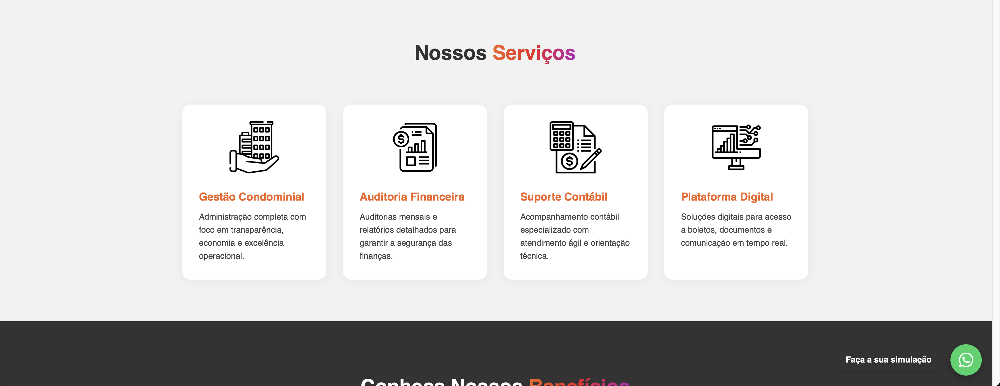
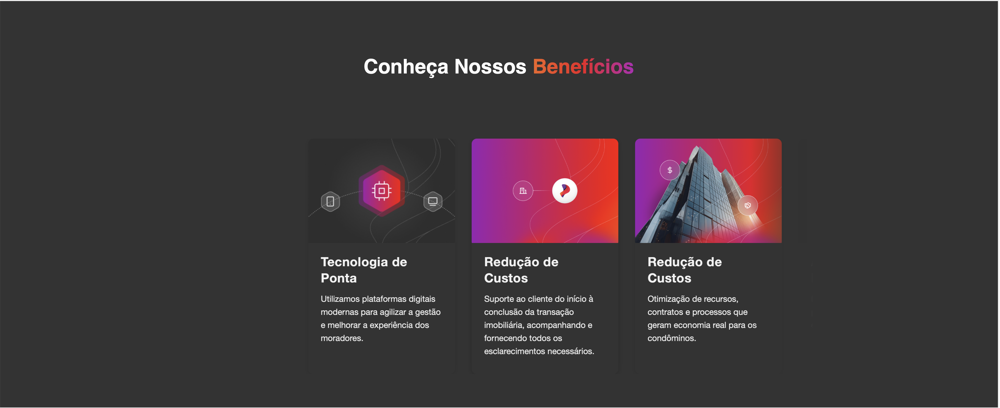
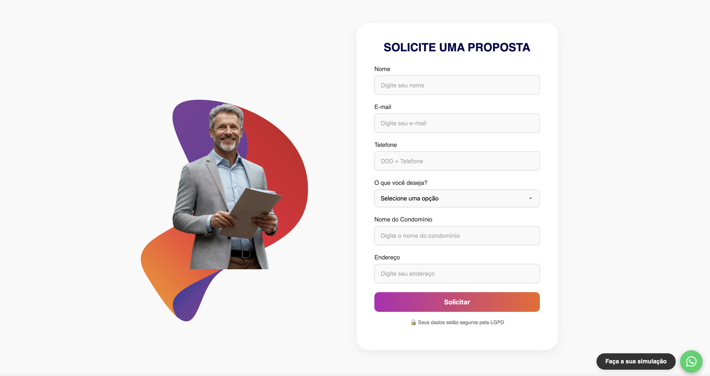
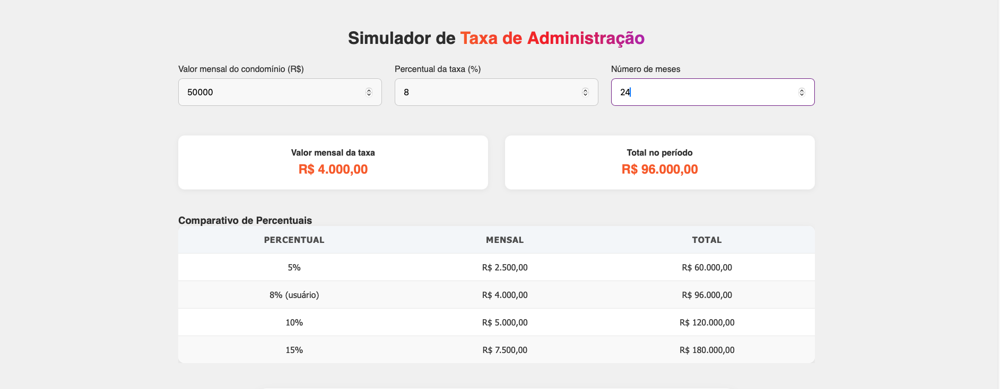
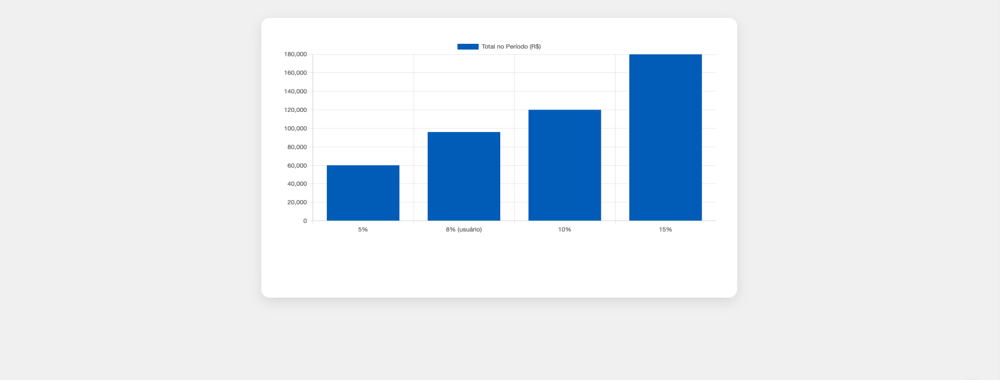
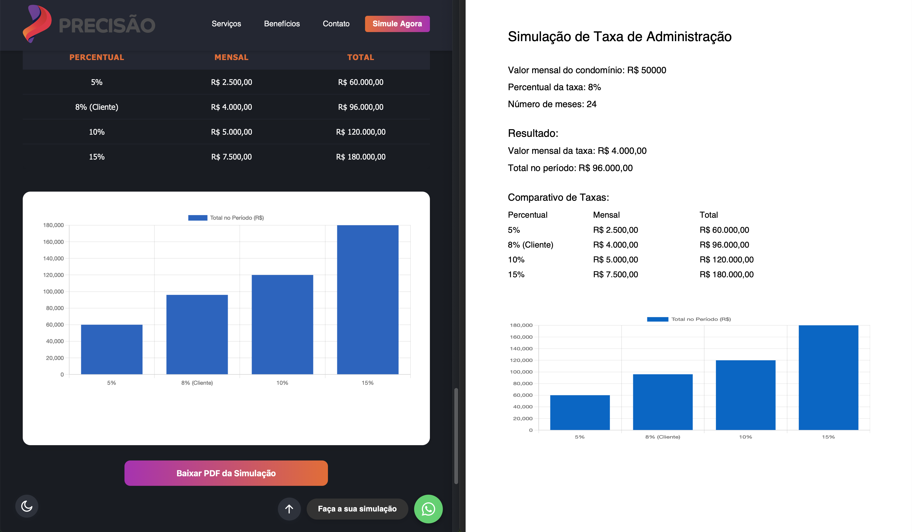

# Simulador de Taxas - Grupo Precisão

Bem-vindo ao repositório do **Simulador de Taxas - Grupo Precisão**!  
Este projeto é um site moderno e responsivo, desenvolvido para facilitar a simulação de taxas de administração condominial, apresentar os serviços do Grupo Precisão e permitir o contato direto com a equipe.

---

## ✨ Funcionalidades

- **Simulador de Taxa de Administração:**  
  Permite ao usuário calcular o valor mensal e total da taxa de administração, comparar diferentes percentuais e visualizar os resultados em tabela e gráfico de forma dinâmica.

- **Apresentação de Serviços:**  
  Seção dedicada aos principais serviços oferecidos pela empresa, com ícones ilustrativos e descrições.

- **Carrossel de Benefícios:**  
  Destaque visual dos principais benefícios de ser cliente.

- **Formulário de Contato:**  
  Formulário validado para solicitação de propostas.

- **Layout Responsivo:**  
  Design adaptável para dispositivos móveis, tablets e desktops.

- **Menu Mobile com Botão Hambúrguer:**  
  Navegação intuitiva em qualquer dispositivo.

- **Botões Flutuantes:**  
  Acesso rápido ao simulador e ao WhatsApp.

- **Dark Mode:**  
  Interface elegante com alternância entre modo claro e escuro.

- **Pop-up Timer:**  
  Pop-up automático após tempo de navegação, para engajamento do usuário.

- **Página de Agradecimento:**  
  Após o envio do formulário de contato, o usuário é redirecionado para uma página de agradecimento elegante e integrada ao layout.

- **Google Maps Integrado:**  
  Mapa interativo na seção de contato, facilitando a localização da empresa.

- **Geração de PDF:**  
  O usuário pode gerar um PDF personalizado com todos os dados da simulação, incluindo a tabela comparativa e o gráfico do simulador.


---

## 🛠️ Tecnologias Utilizadas

- **HTML5**  
  Estrutura semântica das páginas.

- **CSS3**  
  Estilização avançada, responsividade, animações e uso de variáveis CSS.

- **JavaScript (ES6+)**  
  Lógica do simulador, manipulação do DOM, validação de formulários e integração com APIs.

- **[Chart.js](https://www.chartjs.org/)**  
  Biblioteca para renderização de gráficos dinâmicos.

- **Font Awesome**  
  Ícones sociais e visuais.

- **Google Fonts (Inter, Segoe UI)**  
  Tipografia moderna e legível.

---


## 🚀 Como Executar o Projeto

1. **Clone o repositório:**
   ```sh
   git clone https://github.com/seu-usuario/grupo-precisao.git

2. Abra o arquivo index.html no seu navegador.

3. Pronto! Não é necessário backend para funcionamento das principais funcionalidades.


🖼️ Prints do Site













## 👤 Autor

- **Nome:** Leonardo Veras
- **LinkedIn:** [linkedin.com/in/laveras](https://linkedin.com/in/laveras)

---


